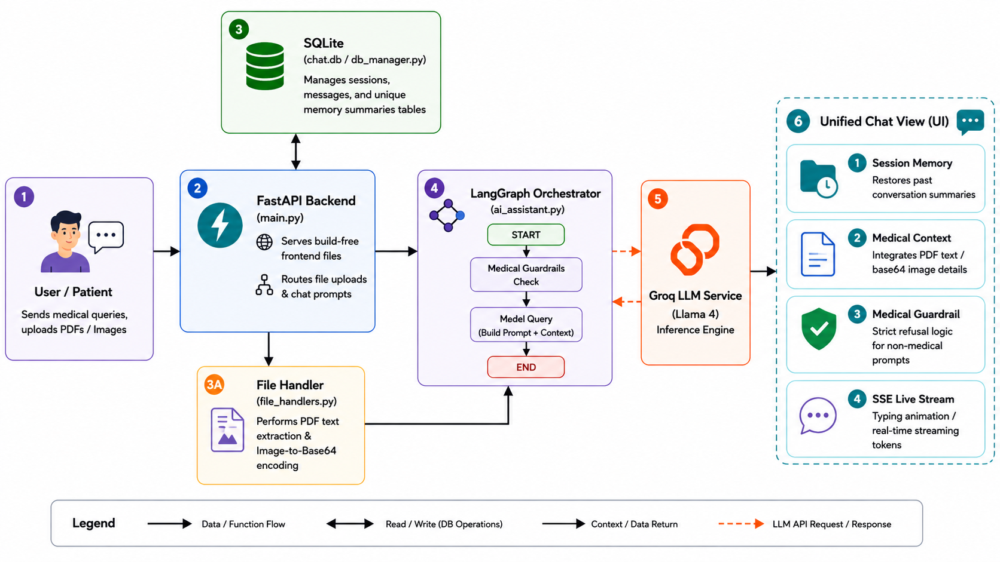
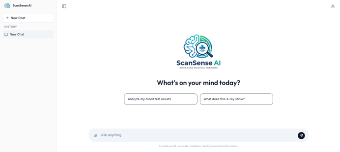
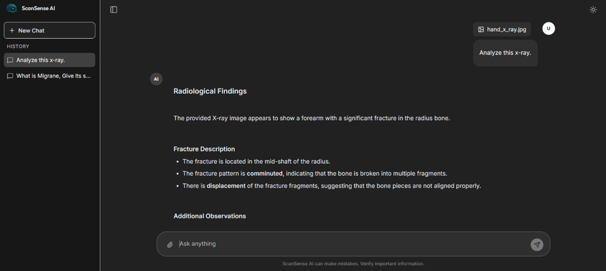

<div align="center">

  <h1>🧿 ScanSense AI</h1>

  <p>
    <b>An autonomous, guardrail-first medical assistant powered by LangGraph, FastAPI, and Llama 4 via Groq. Intelligently validates, correlates, and analyzes medical reports and diagnostic images in real time.</b>
  </p>

  <p>
    
    
    
    
    
    
    
  </p>

</div>

---

## 📋 Table of Contents

* [Overview](#-overview)
* [The Problem We Solve](#-the-problem-we-solve)
* [Key Features](#-key-features)
* [System Architecture](#-system-architecture)
* [Application Screenshots](#-application-screenshots)
* [AI Orchestration Pipeline](#-ai-orchestration-pipeline)
* [Tech Stack](#-tech-stack)
* [Project Structure](#-project-structure)
* [Getting Started](#-getting-started)

---

## 📖 Overview

**ScanSense AI** is a highly specialized, multimodal medical assistant designed for both patients and healthcare professionals. Unlike generic chatbots, ScanSense is strictly bound to the medical domain. It uses a custom LangGraph pipeline to analyze raw medical text (PDF reports) and interpret diagnostic images (X-rays, MRIs, CT scans) while actively blocking non-medical prompts (e.g. coding, math, general knowledge). 

It features a **Build-Free Unified Architecture**: a high-performance FastAPI server handles the backend inference engine and database logic while directly serving the lightweight, responsive Vanilla JS/Tailwind CSS frontend on a single port—meaning no node compilation or `npm` setup is required to run the project.

---

## 🚨 The Problem We Solve

| Pain Point | ScanSense AI Solution |
|---|---|
| **Multi-modal Visual Interpretation** | Directly parses medical PDFs (via `PyPDF2`) and base64 encodes PNG/JPG images (via `PIL`) to feed to multimodal models. |
| **Jailbreaks & Non-Medical Abuse** | Enforces a dual guardrail system (pre-flight validation + late-binding constraints) to reject off-topic questions. |
| **Fragmented / Unsafe Storage** | All conversation data remains local and secure in an offline SQLite database (`chat.db`), ensuring user medical privacy. |
| **Bloated Node JS Tooling** | Eliminates build configs, bundlers, and npm dependencies. Serves a clean client UI directly via FastAPI. |
| **Stale Memory and Context** | Generates session summaries and links history to provide long-term cognitive persistence across separate sessions. |

---

## ✨ Key Features

<ul>
  <li><b>🧠 Multimodal Visual Analysis</b> — Upload raw PDFs (blood tests, prescriptions) or medical images (X-rays, MRIs) and ask questions directly.</li>
  <br />
  <li><b>🛡️ Strict Domain Guardrails</b> — Double-layer prompt engineering completely refuses to answer non-medical topics (coding, general Q&A, math).</li>
  <br />
  <li><b>⚡ Progressive Server-Sent Events (SSE)</b> — Streams assistant responses token-by-token. Implements a Carriage Return Hack (<code>\n</code> to <code>\r</code>) to prevent raw SSE chunk breaks.</li>
  <br />
  <li><b>💾 Relational Session Memory</b> — Retains context locally in SQLite across three schema tables: <code>sessions</code>, <code>messages</code>, and <code>memory_summaries</code>.</li>
  <br />
  <li><b>📝 Lightweight Regex Markdown Parser</b> — Built-in custom JS script renders markdown layout (headings, lists, bold text, horizontal rules) dynamically without bulky libraries.</li>
  <br />
  <li><b>🚀 One-Click Bootstrapper</b> — Native start scripts automatically configure virtual environments, resolve pip modules, and launch the application.</li>
</ul>

---

## 🏗️ System Architecture

Our clean, high-level sequential flow maps the execution path from the user's browser, through the FastAPI gateway, file processors, LangGraph orchestrator, SQLite database, and the Groq LLM API.



---

## 📸 Application Screenshots

### 1. Welcome Interface (Light Mode)
*Clean, minimal, card-based interface featuring dynamic quick prompt suggestions.*
<p align="center">
  
</p>

### 2. Multimodal Medical Analysis (Dark Mode)
*Active chat interface analyzing an uploaded X-ray report and streaming structured findings.*
<p align="center">
  
</p>

---

## 🤖 AI Orchestration Pipeline

ScanSense AI routes all context and messages through a stateless LangGraph workflow. The pipeline state consists of message histories, text context, and content types.

| Phase | Agent / Function | Model | Task |
|---|---|---|---|
| **1: Validation** | `is_medical_content()` | Llama 4 Scout (Groq) | Runs pre-flight validation on the input text/image context at `temperature=0.0`. Returns `True` (YES) or `False` (NO). |
| **2: Orchestration** | `stream_chat_response()` | Llama 4 Scout (Groq) | Merges the system prompt, short-term history, active file context, and the top 5 long-term session summaries, then streams responses. |
| **3: Memory Summary** | `summarize_session()` | Llama 4 Scout (Groq) | Runs asynchronously in the background once a chat session has $\ge 2$ exchanges to write a 3-sentence summary stored in `memory_summaries`. |

---

## 🛠️ Tech Stack

### Backend & AI Layer

| Component | Technology |
|---|---|
| **API Framework** | FastAPI (Python 3.11) + Uvicorn |
| **Orchestration** | LangGraph + LangChain Core |
| **Primary LLM** | Meta Llama 4 Scout 17B via Groq API (Deterministic Temperature: 0.0 for validation, Conversational: 0.7) |
| **File Handlers** | PyPDF2 (PDF text extraction), PIL / Pillow (Image processing) |
| **Database** | SQLite3 (Direct driver logic) |

### Frontend Client

| Component | Technology |
|---|---|
| **UI Framework** | Vanilla HTML5 / ES6 Javascript (No compile step required) |
| **Styling** | TailwindCSS (via CDN) |
| **Icons** | Lucide Icons (via CDN) |
| **Networking** | JavaScript Streams API / Fetch API (Event stream reader) |

---

## 📁 Project Structure

```
ScanSense-AI/
│
├── backend/                      # Python Server & Logic Engine
│   ├── main.py                   # FastAPI application, REST endpoints, SSE streams, static serving
│   ├── requirements.txt          # Python module dependencies
│   ├── chat.db                   # Local SQLite Database (auto-generated on startup)
│   │
│   ├── config/                   
│   │   └── settings.py           # Configuration: System Prompts, models, API keys
│   │
│   ├── database/                 
│   │   └── db_manager.py         # SQLite connection manager, tables creation, session history queries
│   │
│   └── utils/                    
│       ├── ai_assistant.py       # LangGraph Chatbot StateGraph, Stream chat methods, validation guardrails
│       └── file_handlers.py      # Base64 image codecs and PDF text parsing helpers
│
├── frontend/                     # Client User Interface Assets
│   ├── index.html                # Semantic UI Layout grid
│   ├── app.js                    # Chat logic, DOM, file upload API, SSE stream decoder, markdown parser
│   ├── styles.css                # Custom Webkit scrollbars and keyframe dot animations
│   ├── logo.png                  # Brand logo light
│   └── logo1.png                 # Brand logo dark
│
├── images/                       # Project Screenshots and Diagrams
│   ├── welcome_light.png         
│   ├── chat_light.png            
│   ├── welcome_dark.png          
│   ├── analysis_dark.png         
│   └── system_architecture.png   
│
├── run.bat                       # One-click startup script (Windows)
├── run.sh                        # One-click startup script (macOS/Linux)
├── test_langgraph.py             # Local CLI validator testing script
└── .gitignore                    
```

---

## 🚀 Getting Started

### Prerequisites

Ensure you have **Python 3.10+** installed on your system. 

*(Note: Because of our build-free Vanilla JS architecture, you do not need Node.js, `npm`, webpack, or any JavaScript compilers!)*

---

### 1. Clone the Repository

```powershell
git clone https://github.com/animus08/ScanSense-AI.git
cd ScanSense-AI
```

---

### 2. Configure Environment Variables

Create a file named exactly `.env` inside the **`backend/`** directory. Add your free Groq API key:

```env
GROQ_API_KEY=gsk_your_groq_api_key_goes_here
```

> [!WARNING]
> The cloned repository may contain a pre-existing `.env` file in the root folder. For runtime security and proper setup, please ensure your actual environment variables are placed in the **`backend/.env`** file. You should also delete or secure any `.env` file in the root folder to prevent API key exposure.

---

### 3. Startup the Server

Run the automated bootstrapper script from the **root folder**:

**On Windows:**
```cmd
.\run.bat
```

**On macOS / Linux:**
```bash
chmod +x run.sh
./run.sh
```

**What this script does automatically:**
1. Creates a Python virtual environment (`venv`) if it doesn't exist.
2. Activates the environment and installs modules from `backend/requirements.txt`.
3. Navigates to `backend/` and starts the FastAPI Unified Server on **Port 8000**.

---

### 4. Access the App

Open your browser and navigate to:
```text
http://localhost:8000
```
You can now start chatting, uploading reports, and analyzing medical diagnostic files!
